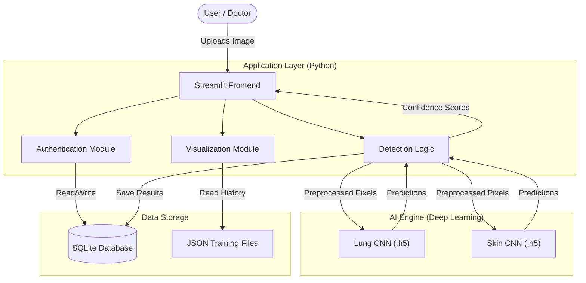
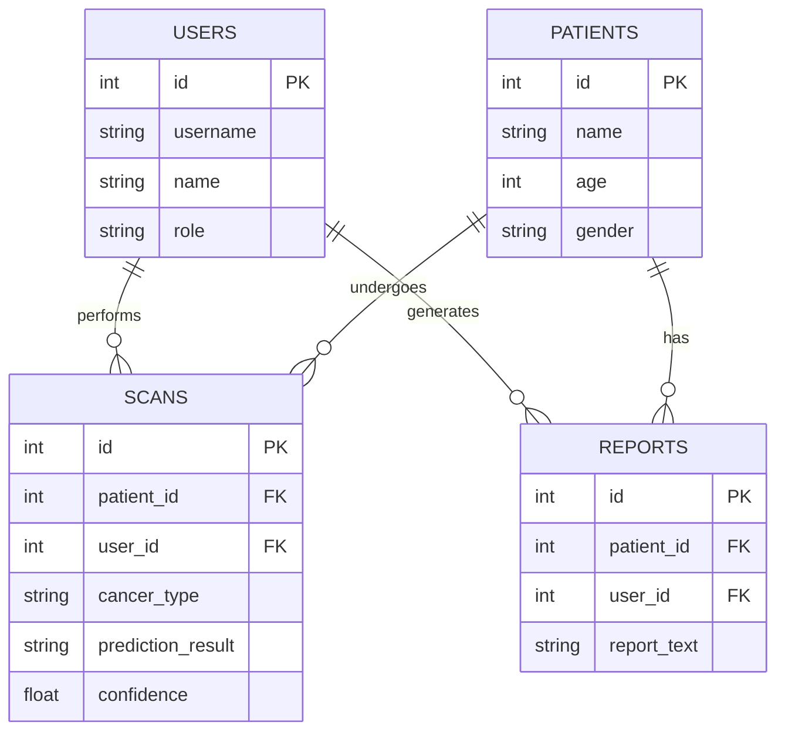
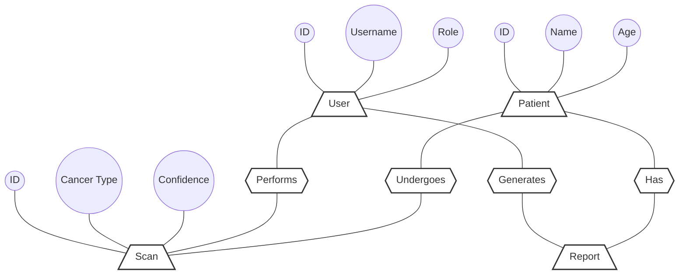

# 🏥 Cancer Detection: Project Architecture & ER Diagrams

This document summarizes the technical design of the Cancer Detection system. It includes the software architecture and the database relationship models.

---

## 📐 1. System Architecture
This diagram illustrates the flow of data from the user interface through the AI processing layer to the final storage.

---

## 🗄️ 2. Modern ER Model
A relational map showing the connections between Users, Patients, Scans, and Reports.

---

## 🎨 3. Classical ER Diagram (Chen Notation)
A traditional representation using standard symbols (Rectangles for Entities, Ovals for Attributes, Diamonds for Relationships).

